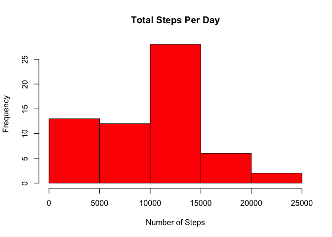
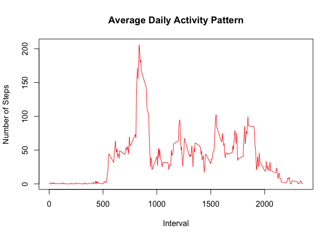
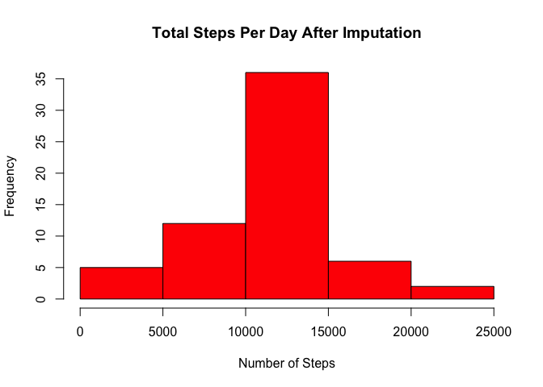
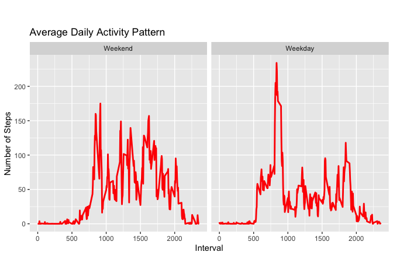

Exploration of Activity Monitoring Data
================
Tolu Omotunde
25/Aug/2020

## Loading and preprocessing the data

``` r
rm(list=ls())
library(data.table)
library(base)
library(utils)
library(dplyr)
library(ggplot2)
url <- "https://d396qusza40orc.cloudfront.net/repdata%2Fdata%2Factivity.zip"
wd <- getwd()
download.file(url, file.path(wd, "dataFiles.zip"))
unzip(zipfile = "dataFiles.zip")
activity <- read.table(file = "activity.csv", dec = ".", stringsAsFactors = FALSE, colClasses = c("numeric", "character", "numeric"), header = TRUE, sep = ",", na.strings = "?")
activity$date <- as.Date(activity$date)
```

## What is mean and median total number of steps taken per day?

``` r
total_steps <- summarize(group_by(activity, date), steps = sum(steps, na.rm = TRUE))
hist(total_steps$steps, col = "red", main = "Total Steps Per Day", xlab = "Number of Steps")
```

<!-- -->

The mean total number of steps per day is 9354.23.

The median total number of steps per day is
1.039510^{4}

## What is the average daily activity pattern?

``` r
averaged_interval <- summarize(group_by(activity, interval), steps = mean(steps, na.rm = TRUE))
plot(averaged_interval$interval, averaged_interval$steps, type="l", col="red", main="Average Daily Activity Pattern", xlab= "Interval", ylab="Number of Steps")
```

<!-- -->

From the plot, it is seen that the 900th interval has the maximum number
of steps.

There are 2304 missing values in the dataset. They constitute about
13.11% so we’re going to impute the mean for that 5-minute
interval.

## Imputing missing values

``` r
new_activity <- group_by(activity, interval) %>%  mutate(steps= ifelse(is.na(steps), mean(steps, na.rm=TRUE), steps))
new_total_steps <- summarize(group_by(new_activity, date), steps = sum(steps, na.rm = TRUE))
hist(new_total_steps$steps, col = "red", main = "Total Steps Per Day After Imputation", xlab = "Number of Steps")
```

<!-- -->

The mean total number of steps per day after imputation is
1.07661910^{4}.

The median total number of steps per day after imputation is
1.07661910^{4}

The mean and median of the total number of steps taken daily increased
after imputing the values of the mean step for the 5-minute interval.
Also the data seems to follow a normal
distribution.

## Are there differences in activity patterns between weekdays and weekends?

``` r
activity["weekday"] <- weekdays(activity$date)
#create a vector of weekdays
week_days <- c('Monday', 'Tuesday', 'Wednesday', 'Thursday', 'Friday')
#Use `%in%` and `weekdays` to create a logical vector
#convert to `factor` and specify the `levels/labels`
activity$day_type <- factor((weekdays(activity$date) %in% week_days), levels=c(FALSE, TRUE), labels=c('Weekend', 'Weekday'))
averaged_day_type <- summarize(group_by(activity, day_type, interval), steps = mean(steps, na.rm = TRUE))
ggplot(averaged_day_type, aes(interval, steps)) +
  geom_line(color = "red",size = 1) + labs(title="Average Daily Activity Pattern", x= "Interval", y="Number of Steps") + theme(aspect.ratio = 1) + facet_wrap(~ day_type)
```

<!-- -->
